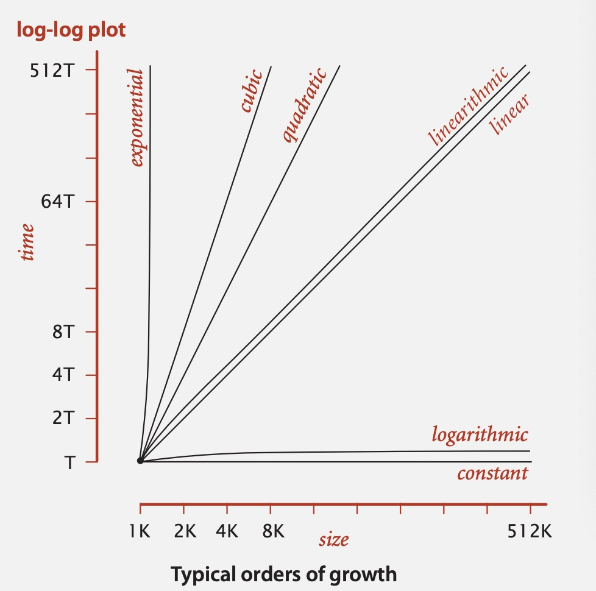
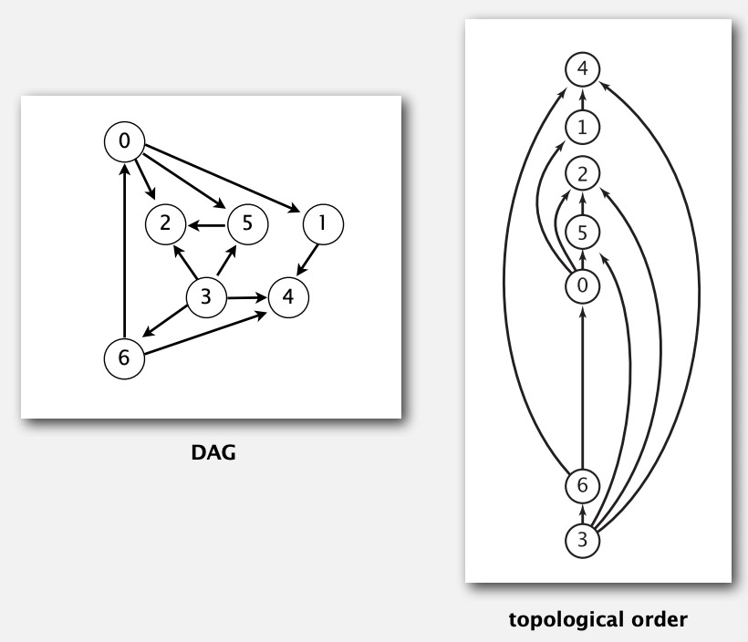
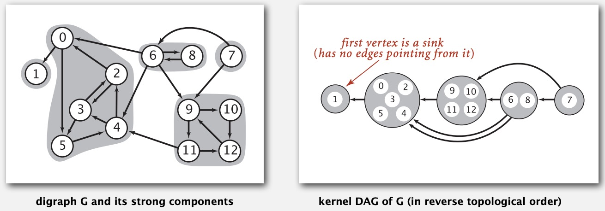
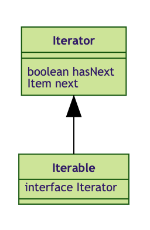

# Algorithms Note

The Lecture Note About Algorithms.

## Tips

If you wanna run programs in each part(folder), it is necessary to add ```-cp [classpath]``` flag when compiling.

For example:

```shell
$ java -cp [classpath] [filename].java
```

# Lecture 1: Union-Find


Union Find could be modelized as a dynamic connectivity problem.

**Model Union Find**

- public class Union Find
- union(p, q): connect p and q
- find(p, q): find whether p-q is connected.

**Idea**

- Reflexive: p is connected to p.
- Symmetric: if p-q is connected, also q-p.
- Transmitive: if p-q, q-r, thus p-r.

- connected components.

## Quick Find

Connected node i's ```id[i]``` are all equal.

```java
 public boolean find(int p, int q){
	 return id[p] == id[q];
 }
```

|algo|init|union|find|
|:--:|--:|--:|--:|
|quick find| N  | N  | 1  |


## Quick Union

**Interpreter**

- ```id[i]``` is i's parent.
- root of i is ```id[id[...id[i]...]]```

```union(p,q) => id[root(p)] = root(q);```

## Quick Union+

**Weighten quick union**

It could avoid the worst case.

use ```sz[i]``` in union.

```O() < lgN```

**Paths compression**

use ```id[i] = id[id[i]]``` in ```root()```.

```O() < N + MlgN```<- Proved by Tjan, and I would discuss about it in my blog later.

|algo|init|union|find|
|:--:|--:|--:|--:|
|quick union(worst)| N  | N  | N  |
|quick union+ |  N | N+MlgN  | N+MlgN  |

# Lecture 2: The Analysis of Algorithms

**Reasons to analyze algorithms**

1. Predict performance.
2. Compare algorithms.
3. Provide guarantees.
4. Understand theoretical basis.

**Scientific Method**

1. Observe some feature of the nature world.
2. Hypothesize a model that is consistent with the observation.
3. Predict events using the hypothesis.
4. Verify the predictions by making further observations.
5. Validate by repeating until the hypothesis and observations.

**Observation**

```java
Stopwatch();//Princeton STL
```

**Mathematic Model**

$$RunningTime = Frequency \times Cost$$


> Simplifying the calculations

* Cost Model
Use some basic operation as a proxy for running time.

* Tilde Notation
Estimate running time (or memory) as a function of input size N.

Ignore lower order terms.
- when N is large, terms are negligible.
- when N is small, we don't care.

Estimate as Discrete Math Model:

$$\sum_N i = \int_0^N xdx = \sim N^2$$
$$\sum_N\sum_N\sum_N i= \int_0^N (\int_0^z (\int_0^yxdx)dy)dz = \sim N^4$$

**Order-of-growth**

The small set of functions:

$1, \log N, N, NlogN, N^2, N^3,$ and $2^N$

suffices to describe ordered-of-growth of typical algorithms.

  


* Common order-of-growth classifications

|Order of Growth|Name|Typical code framework|description|example|
|:--:|:--:|--:|--:|--:|
|1   |  Constant |  ```a += b``` | statement  | add two numbers  |
|$\log N$   | Logarithmic  | ```while(N > 1){N = N / 2;...}```  |  divide in half | BinarySearch  |
| N  |  Linear | ```for(i = 0; i < N){...;}```  | loop  | find max/min   |
|$N\log N$   |  Linearithmic |  mergesort | divide and conquer  |  mergesort |
|$N^2$   | Quadratic  | double loop  |  double loop | check all pairs  |
|$N^3$   | Cubic  |  triple loop | triple loop  |  check all triples |
|$2^N$   | exponential  | combinatorial search  | exhaustive search  |  check all subsets |


**Theory of Algorithms**

|Upper Bound(Big Oh)|
|:--:|
|**Optimal Algo(Tilde Notation, Big theta)**   |
|**Lower Bound(Big Omega)**   |

**Memory**

> Typical memory usage for objects in Java

* Object overhead. 16 bytes
* Reference. 8 bytes
* Padding. Each object uses a multiple of 8 bytes.

> Typical Memory usage summary

>Total memory usage for a data type value:

* Primitive type: 4 bytes for int, 8 bytes for double,...
* Object reference: 8 bytes.
* Array: 24 bytes + memory for each array entry
* Object: 16 bytes + memory for each instance variable + 8 bytes if inner class(for pointer to enclosing class)
* Padding: round up to multiple of 8 bytes.

>Shallow memory usage: Don't count referenced objects.

>Deep memory usage: If array entry or instance variable is a reference, add memory(recursively) for referenced object.


# Lecture 3: Stacks and Queues

## Stack
- ```push()```: Tail is NULL

### Implementation

>Resizing Array --> Space Efficiency

>Linked-List --> Time Efficiency

- Resizing Array

>Resize stragedy:
1. When N == s.length, double;
2. When N == s.length/4, half;
3. s.length / 4 < N < s.length; 

* Point: 

1. push()
```java
public void push(T item){
	if(N == s.length){
		resize(2 * s.length);
	}
	s[N++] = item;
}
```

2. pop()

```java
public String pop(){
	String item = s[--N];
	s[N] = null;
	if( N > 0 && N < s.length/4){
		resize(s.length / 2);
	}
	return item;

}
```

3. resize()

```java
public void resize(int cap){
	String[] copy = new String[cap];
	for(int i = 0; i < s.length; i++){
		copy[i] = s[i];
	}
	s = copy;
}
```


- Linked List

* Point:

1. push(item): 

```java
public void push(T item){
	Node oldtop = top;
	top.item = item;
	top.next = oldtop;

}

```
2. pop()

```java
public void pop(){
	top = top.next;
}

```

## Queue

**Idea:**

1. 2 Nodes: first & last
2. if(IsEmpty()): (At least one node left)

* Enqueue(): first = last;
* Dequeue(): last = first;


## JAVA's Generic

Sort of similar with C++'s Template.

E: Element in Set
T: Class

```java

public class Demo{
	public static <E> void print(E[] array){
		for( E element : array){
			System.out.println("%s", element);
		}

	}

	punlic static void main(String[] args){
		Integer[] intArray = {1, 2, 3};
		Double[] doubleArray = {1.1, 2.2, 3.4};
		//
	   
	}
		
	
}


```

**Good Code has Zero Cast.**

> Primitives all have Wrapper Type.
**i.e.:** int has a wrapper type called Integer

>AutoBoxing: Automatic cast between primitives and wrappers

>Syntactic Sugar: Behind-the-scenes casting

## Java's API

```java
import java.util.List;
import java.util.ArrayList;//resizing array
import java.util.LinkedList;//linked list
import java.util.Stack;
import java.util.Queue;
```

Main Application: Adding items to a collection and iterating.

```java
public class Bag<item> implements Iterable<item>{
	Bag();
	void add(item x);
	int size();
	Iterable<item>  iterator();
}
```

**Dijkstra's Two Stack Algorithms**

1. Left Parenthesis: Ignore
2. Right Parenthesis: Operate
3. Value: push into value stack
4. Operator: push into operator stack


**Syntax Memo**

```java
s[N++] = 10;

//equal to

s[N] = 10;
N += 1;

/****************/

s[++N] = 10;

//equal to

N += 1;
s[N] = 10;
```

# Lecture 4: Sort

## Element Sort

**Two useful abstractions**

- Helper functions: Refer to data through compares and exchanges.
- Less: Is item v less than w?
- Exchange: Swap item in array a[] at index i with the one at index j.

**compareTo()**

- Totality
- Transitivity
- Antisymmetry

**Selection Sort**

- In iteration i, Find index *min* of smallest remaining entry.
- swap a[min] and a[i].
- O(n^2)
- Defect: It's a waste of time for partially-sorted array.

**Insertion Sort**

- In iteration i, swap a[i] with each larger entry to its left.
- Partially-sorted array: O(N)--> (Because N(inv) < cN;  N(Exchange) = N(inv), N(inv) < N(Compare) < N(inv) + N - 1)
- Random array: O(N^2)

**Shell Sort(Insertion sort)**

- h-sort: First, define increment; Second, insertionsort every h increments.

```java
while( h > 0 )//change increment
{
	for( int i = h; i < size; i++)
	{
		for( int j = i; j >= h; j -= h)
		{
			if(a[j] > a[j - h])
			{
				swap(j, j - h);
			}
		}
		
	}
	h = h / 3;
}

```

>Why insertion sort?

- Big increments => small subarray
- Small increments => nearly in order

> Which increment sequence to use?

**Problem**

1. Why increment h = 3h + 1 ?
2. Why O(N^3/2) ?


**Shuffling**

- In iteration i, pick integer *r* between 0 and i uniformly at random, swap a[i] and a[r].

**Convex Hull**

- Graham Scan

## MergeSort

**Divide and Conquer**

1. Recurrence(Extra Space)

- Divide array into two halves.
- Recursively sort each half.
- Merge two halves.

2. Bottom-up

- Pass through array, merging subarrays of size 1.
- Repeat for subarrays of size 2, 4, 8...


## Quicksort

**Basic Plan**

- Shuffle the array
- Partition so that, for some j
  1. Entry a[j] is in place.
  2. No larger entry to the left of j
  3. No smaller entry to the right of j
- Sort each piece recursively

**Partition**

>Repeat until i and j pointers cross

- Scan i from left to right so long as (a[i] < a[lo]).
- Scan j from right to left so long as (a[j] > a[lo]).
- Exchange a[i] with a[j].

>When pointers cross

- Exchange a[lo] with a[j].

**Dijkstra 3-Way Quicksort**


### Java's sort

- Tuned QuickSort for Primitives, Tuned MergeSort for objects.

```java
import java.util.Arrays;

Arrays.sort(a);

```


### JAVA Syntax

> Implement "swap" func in JAVA

1. Definite out of  Method(in the class)
2. Definite in obj(```int[], String[]```)

# Lecture 5: Priority queue

>Collection: 

Insert and delete items.
  
>Delete:

- Stack: Remove the item most recently added
- Queue: Remove the item least recently added
- Randomized Queue: Remove a random item
- Priority queue: Remove the largest(or Samllest) item

>Priority Queue

- Unordered: Insert: O(1), Delmax: O(N), Max: O(N)
- Ordered: 	Insert: O(N), Delmax: O(1), Max: O(1)
  
## Binary Heap

- Binary Tree & Parents >(<) Children

**Basic Plan**

- Swim(int children)
- Sink(int Parent)

## Non Comparison Sort

- Radix Sort
- Counting Sort
- Bucket Sort

### Radix Sort

### Counting Sort

### Bucket Sort

# Lecture 6: Search & Symbol Table

**Symbol Table**

Key-value pair abstraction.

- Insert a value with specified key.
- Given a key, search for the corresponding value.

**Convention**

- Values are not null.
- Method ```get()``` returns ```null``` if key not present.
- Method ```put()``` overwrites old value with new value.

**Intended Consequences**

- Easy to implement ```contains()```
- Can implement lazy version of ```delete()```.

- Equal (x.equal(y)(PS: Non-Null)) for objects

## Elementary Table

> Only 1 to 1

- Associative array Abstractions


> Sequential search in a linked list

**Symbol Table** <-- Also Known as key-value pair abstraction.

In computer science, a symbol table is a data structure used by a language translator such as a compiler or interpreter, where each identifier(or symbol) in a program's source code is associated with information relating to its declaration or appearance in the source. In other words, the entries of a symbol table store the information related to the entry's corresponding symbol.

## Binary Search Trees

- Del: Hibbard del
- Get
- Put

Correspondence betweeen QuickSort's Partition & BinarySearch Tree: 1-1


## 2-3 Tree and Red-Black Tree (The Derivative of 2-3 Tree)[Weak Balance]

In there, I just wanna talk about Red Black Tree.

**Basic Idea**

- Rotate left: Right child Red.
- Rotate Right: Left child & left-left grandchild Red.
- Flip Red: Both sides of children Red.

**Problem**

  Red Black Tree and 2-3 Tree only support **insert and search** functions which could guarantee the balance. The deletion machanism is implemented by **Hibbard deletion**, which tends to make balance crash.

  > Update: You could perfectly trick this problem by using ```moveRedLeft(Node)``` and ```moveRedRight(Node)``` API.

**Deletion**

The discussion about how to delete in RedBlack BST is [here](https://peterwrighten.github.io/2021/12/27/RedBlack-BST-New-Type-Art/).

## AVL Tree [Rough Balance]

- Evaluate Tree's Balance.

> Recursive Definition

N.Height equals: 

1. if N is a leaf: 

```1 + max(N.left.Height, N.right.Height)```

```cpp

class Node{
	int data;
	Node* parent;
	Node* left;
	Node* right;
	int Height;
}

```

**AVL Property**

AVL trees maintain the following property:

For all nodes N, 

```|N.left.Height - N.right.Height| <= 1```

**Implementation**

```cpp
AVLInsert(k, R) {
	insert(k, R);
		
	rebalance(R);

}
```

## Geometric Application of BST

**1d Range Search**

>Unordered Array: 

Range Count & Search: O(N) <-- Sequential Search

> Ordered Array:

Range Count & Search: O(logN) <-- Binary Search for ```lo``` & ```hi```.


### Line Segment Intersection

> Sweep-Line Analysis 

**Sweep vertical line from left to right.**

- x-Coordinates define events.
- h-segment(left endpoint): insert y-coordinate into BST.
- h-segment(right endpoint): remove y-coordinate from BST.
- v-segment: range search for interval of y-endpoints.


### Kd Tree: Video Game

> Space partitioning trees

- Partitioning Nodes by direction of Segments(Vertical or Horizonal).

### Interval Search Trees

**Basic Idea**

- Left Endpoint is Key.


### Rectangle Intersection Search: Microprocessor Design


## Hash Table

Hash Table is other type of Symbol Table implementation which is distinct with BSTs.

### Uniform Hash Assumptions

Each key is equally likely to hash to an integer between 0 and M-1.

### Hash Functions 

**JAVA Implementation: ```hash()``` & ```hashCode()```**

```java 
public final class PseudoString {
    private int hash = 0;
    private final char[] s;
    public int hashCode() {
        int h = hash;
        if(h != 0) return h;
        for(int i = 0; i < length(); i++) 
            h = s[i] + (31 * h);
        hash = h;
        return h;       
    }
    //...
}
```

1. "31x + y" Rule

### Hash Collision

#### Seperate Chainning

#### Linear Probing

##### Rehashing


> Hash Table & BSTs API in JAVA

1. Hash Table: ```java.util.HashMap```, ```java.util.IdentityHashMap```
2. Red-Black Tree: ```java.util.TreeMap```, ```java.util.TreeSet```


# Lecture 7: Graph & Search

**Some Graph-Processing Problems**

- Path. Is there a path between ```s``` and ```t``` ?
- Shortest path. What is the shortest path between ```s``` and ```t``` ?
- Cycle. Is there a cycle in the graph ?
- Euler tour. Is there a cycle that uses each edge exactly once ?
- Hamilton tour. Is there a cycle that uses each vertex exactly once?
- Connectivity. Is there a way to connect all of the vertices ?
- MST. What is the best way to connect all of the vertices ?
- Biconnectivity. Is there a vertex whose removal disconnects the graph ?
- Planarity. Can you draw the graph in the plane with no crossing edges ?
- Graph isomorphism. Do two adjacency lists represent the same graph ?

## Undirected Graph

### Graph API

```java
public class Graph {
	Graph(int V); // Create an empty graph with V vertices. 

	Graph(In in); // Create a graph from input stream 

	void addEdge(int v, int w); // add an edge v-w
	
	Iterable<Integer> adj(int v); // vertices adjacent to v 

	int V(); // number of vertices.

	int E(); // number of edges.

	String toString(); // String representation.	

	public static void main(String[] args) {
		In in = new In(args[0]);
		Graph G = new Graph(in);

		for(int v = 0; v < G.V(); v++) {
			for(int w: G.adj(v)) {
				StdOut.println(v + "-" + w):
			}
		}
	}

}
```

### Graph-Processing Algorithms 

- **Design Pattern For Graph Processing**

Decouple graph data type from graph processing. 

- Create a Graph object.
- Pass the Graph to a graph-processing routine.
- Query the graph-processing routine for information.

> API: Paths

```java
public class Paths {
	Paths(Graph G, int s);
	boolean hasPathTo(int v);
	Iterable<Integer> pathTo(int v);
}

```


#### Depth-First Search(Put unvisited vertices on a stack)

- Goal: Systematically search through a graph.
- Idea: Mimic Maze Exploration.

```java
DFS(to visit a vertex v)
----------------------------
Marked v as visited.

Recursively visit all unmarked vertices w adjacent to v.
```

- Typical application: 

Find all vertices connected to a given source vertex;

Find a path between two vertices.

#### Breadth-First Search(Put unvisited vertices on a queue)

- Shortest path(Bellman-Ford): Find path from s to t that uses fewest number of edges.


```java
BFS(From source vertex s)
------------------------------
Put s onto a FIFO queue, and mark s as visited;

Repeat until the queue is empty:
 - remove the least recently added vertex v;
 - add each of v's unvisited neighbors to the queue, and mark them as visited.
```

#### Connected Components

- Goal. Partition vertices into connected components.

```java
Connected Components  
------------------------------

Initialize all vertices v as unmarked;

For each unmarked vertex v, run DFS to identify all vertices discovered as part of the same component.

```

## Directed Graph (Digraph)

**Digraph API** is almost same as **Graph API** besides the ```addEdge(int, int)``` part.

### Direected BFS (Same as Undirected Graph)

**Application**

- Multisource shortest Path
- Route

#### Web Crawler: Bare-bones web crawler.

Goal. Crawl web, starting from some root web page.

Solution.[BFS with implicit digraph]

- Choose root web page as source s;
- Maintain a Queue of websites to explore;
- Maintain a SET of discovered websites;
- Dequeue the next website and enqueue websites to which it links. (Provide you haven't done so before.)

### Directed DFS (Same as Undirected Graph)

**Application**

- Reachability APP: Program Control-flow Analysis; Mark-sweep Garbage Collection
- Path finding
- Directed Cycle detection
- Topological Sort


#### Topological Sort

**Precedence scheduling**

Goal. Given a set of tasks to be completed with precedence constraints, in which order should we schedule the tasks?

Digraph model. vertex = task; edge = precedence constraint.

**Topological sort**

DAG. Directed acyclic graph.

Topological sort. Redraw DAG so all edges point upwards.



```java
Topological sort 
----------------------------
1. Run depth-first search.
2. Return vertices in reverse postorder.
```

**Directed Cycle detection Application**

- Precedence scheduling
- Java Compiler: Cyclic inheritance
- Microsoft Excel: Spreadsheet recalculation.

#### Strongly-connected components 

**Strongly connected**

Def. Vertices v and w are strongly connected if there is both a directed path from v to w and a directed path from w to v.

Key propety. Strong connectivity is an equivalence relation:

- v is strongly connected to v.
- if v->w, w->v.
- if v->x, x->w, thus v->w.

**Strong component**

Def. A strong component is a maximal subset of strongly-connected vertices.

**Kosaraju-Sharir Algorithm: intuition**

*Reverse Graph.* Strong components in G are same as G'.

*Kernal DAG.* Contract each strong component into a single vertex.

*Idea.* 

- Compute topological order(reverse postorder) in kernel DAG.
- Run DFS, considering vertices in reverse topological order.

  

```java
Kosaraju-Sharir Algorithm 
------------------------------
Phase 1. Compute reverse postorder in G'.
Phase 2. Run DFS in G, visiting unmarked vertices in reverse postorder of G'.
```

*PS.*  The DFS in the first phase is crucial. The phase 2 is trival as long as the algorithms could mark the set of vertices reachable.


# Lecture 8: Graph & Optimize

Now let's looking at Optimal Problem in Graph, which is much important in Discrete Math & Computer Science.

## Minimum Spanning Tree


## **JAVA Syntax Memo**

> -> About Iterable<T> & Iterator<T>

```java
public interface Iterable<T> {
	Iterator<T> iterator();
}

public interface Iterator<T> {
	boolean hasNext();
	T next();
	void remove(); // Generally ignored
}
```

Interface like this is convenient to definite ReversedIterator & Iterator in sequential data structures.

**Summary**

> Iterable

- In Java Containers, all Subclass of Collection would use ```Iteratable``` interface to implement ```for each``` functions.

   


```java

public class demo<T> implements Iterable<T> {
	//...
	@Override
	public Iterator<T> itreator() {
		return new demoIterator();
	}

	private class demoIterator implements Iterator<T> {
	
		private int current = 0; 

		@Override
		public boolean hasNext() {
			return current != 0;
		}

		@Override 
		public T next() {
			return demo[current++];
		}


	}

}
```

> Generic

- Generic Array: When you wanna initialize a generic array, you should use mandatory casting like that:

```java
@SuppressWarnings("unchecked")
Bag<Integer>[] adj = (Bag<Integer>[]) new Object[V];
//Unchecked type casting; Not safe 
```

- Use Generic Object to new Generic Object:

```java

private Node[] st; /* The generic object of Generic Type */
private static class Node {/* Must be an static class */
	Object key; /* Could just use Object type because static constraint. */
	Object value;
	Node next;
}
```

> Queue<T> is just a implements;

To utilize ```Queue<T>```, We should initialize it like following:

```java
Queue<T> q = new LinkedList<T>();
q.add(T);
q.remove();
```
> Same Package's Compile 

When you wanna compile file in the same package, you should add classpath when compiling. i.e:

```shell
 $ javac -cp [classpath] xxx.java
```

> Reverse Set

You could use ```Collections.reverse()``` to reverse.

```java
import java.util.Collections;
Collections.reverse(l);
```

> Java Memory Management

1. You could only be allowed to change object when you invoke it.

```java
/* FalseCase */

public void delete(Key key) {/* Not invoke Object Parameter (key is a primitive type but not an object) */
	Node k = search(key);/* k is just a stack memory var, could not change object; */
	//... 

}

/* TrueCase */

public Node delete(Node x, Key key) {/* Node is an Object, so you could change it; */
	if(x == null || x.next == null)	return null;
	if(key.equals(x.key)) {
		x = x.next;/* This is not a Stack Memory var, it is an Object, so you could change it. */
	}
	//...

}

/* In C++ */
public: 
	Node delete(Node& x, Key key) {/* if use Reference "&" in C++, it is more like invoke Object in Java. */
		x = x.next;

	}

/* In C */
	Node delete(Node* x, Key key) {/* C does not have reference, You have to use pointers. */
		x = x->next; /* x = (*x).next */

	}
```
